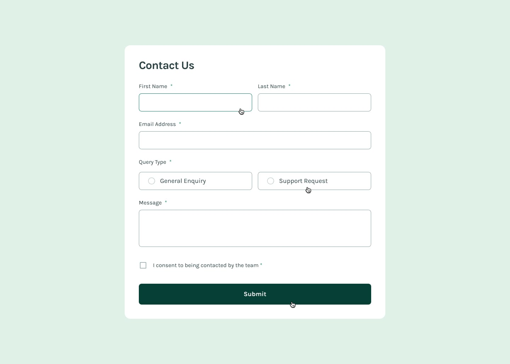

# Frontend Mentor - Contact Form Solution


This is a solution to the [Contact form challenge on Frontend Mentor](https://www.frontendmentor.io/challenges/contact-form--G-hYlqKJj). Frontend Mentor challenges help you improve your coding skills by building realistic projects.


## Overview

### The challenge

Users should be able to:

- ✅ Complete the form and see a success toast message upon successful submission
- ✅ Receive form validation messages if:
  - A required field has been missed
  - The email address is not formatted correctly
- ✅ Complete the form only using their keyboard
- ✅ Have inputs, error messages, and the success message announced on their screen reader
- ✅ View the optimal layout for the interface depending on their device's screen size
- ✅ See hover and focus states for all interactive elements on the page

### Screenshot

#### Desktop Design


#### Mobile Design


#### Success State


#### Error State


#### Hover State


#### Focus and Active State


## My process

### Built with

- ✨ **Semantic HTML5** markup
- 🎨 **CSS Custom Properties** (CSS Variables)
- 📱 **Flexbox & CSS Grid**
- 📲 **Mobile-first** responsive workflow
- ♿ **WCAG Accessibility** guidelines
- 🎯 **Vanilla JavaScript** (ES6+)
- 🎨 **Local Fonts** (Karla Variable Font)
- 🖼️ **Custom SVG Icons**

### Useful resources

- [MDN Web Docs - Forms](https://developer.mozilla.org/en-US/docs/Learn/Forms) - Guide complet sur les formulaires HTML
- [WCAG Guidelines](https://www.w3.org/WAI/WCAG21/quickref/) - Standards d'accessibilité web
- [CSS Tricks - Form Validation](https://css-tricks.com/form-validation-ux-html-css/) - Techniques de validation UX
- [A11y Project](https://www.a11yproject.com/) - Ressources d'accessibilité web

## Author

<!-- - Website - [Votre Nom](https://www.votre-site.com) -->
- Frontend Mentor - [@ovvoso](https://www.frontendmentor.io/profile/ovvoso)
- GitHub - [@ovvoso](https://github.com/ovvoso)

## Acknowledgments

Merci à Frontend Mentor pour ce défi stimulant qui m'a permis de perfectionner mes compétences en :
- Création de formulaires accessibles
- Validation côté client
- Design responsive
- Gestion des états d'interaction

---

## 🚀 Installation et utilisation

### Prérequis
- Navigateur web moderne

### Installation
```bash
# Cloner le repository
git clone https://github.com/votrepseudo/Formulaire-de-contact.git

# Naviguer dans le dossier
cd Formulaire-de-contact

# Ouvrir dans le navigateur
open index.html
```

### Structure du projet
```
Formulaire de contact/
├── index.html              # Page principale
├── style.css               # Styles CSS
├── script.js               # Logic JavaScript
├── assets/
│   ├── fonts/              # Polices Karla locales
│   └── images/             # Icônes SVG et favicon
├── design/                 # Images de référence
└── README.md              # Documentation
```

## 📋 Fonctionnalités

### ✅ Validation de formulaire
- Validation en temps réel
- Messages d'erreur personnalisés
- Validation côté client complète

### 🎨 Interface utilisateur
- Design responsive (mobile-first)
- Animations et transitions fluides
- États hover/focus/active

### 🎯 Expérience utilisateur
- Message de succès avec animation
- Reset automatique du formulaire
- Feedback visuel immédiat

---

*Ce projet fait partie de mes défis Frontend Mentor pour améliorer mes compétences en développement front-end.*
